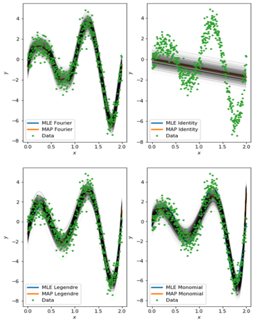
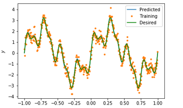

# Data Driven Modelling

## Overview
This repository contains the work done as a part of the [ENM 531: Data Driven Modelling](https://www.seas.upenn.edu/~enm531/) course at Upenn 

## Dependencies
- Numpy
- Scipy
- Matplotplib
- PyDOE
- Sklearn
- autograd
- Tensorflow

## Projects

### MLE and MAP estimates for weights w using different types and numbers of features

run mle\_map/MLE\_MAP\_estimates.ipynb

 

### Optimisation and Logistic Regression

MLE estimates on a linear regression model with M fourier features and a gaussian likelihood
Implementation: Implemented Adam Optimizer from scratch and computed the MLW estimate for both regression weights and noise variance using SGD for 10000 iterations and learning rate 10\^-3

run opt\_logistic\_regression/mle\_est\_on\_LR\_model.ipynb

 

- Given the data from 10000 simulated scenarios, modeled if an electrical grid is stable or not. Implemented a logistic regression model and computed the MLE estimate for the model weights by minimizing the binary cross-entropy loss using stochastic gradient descent updates with the Adam optimizer.

- First 75% of data was used as train and the rest was used as test.

- Achieved 79.95% accuracy

run opt\_logistic\_regression/electrical\_grids.ipynb

### Physics informed Neural Nets

- Used a neural net to approximate the solution u(x) of the Helmholtz equation

 

- This work is an adaptation of work done in _Physics Informed Deep Learning for Nonlinear Partial Differential Equations_ [paper](https://arxiv.org/pdf/1711.10561.pdf)

run understanding\_neural\_nets/phy\_neural\_nets.ipynb

### Basic Convolutional Neural Net and LSTM

- Trained a convolutional neural network on CIFAR-10 dataset in Tensorflow
- Trained weights conv\_nets\_LSTM/Cifar\_10

- Implemented a LSTM recurrent neural network with 8 lags, one hidden layer with 20 neurons and tanh activation. Used the trained model to perform one-step-ahead predictions from T= 45 until final time T=60

 
